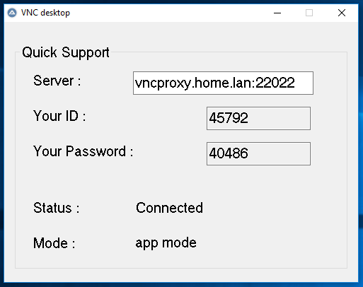

# vncdesktop

VNC running in service mode


VNC running in application mode



# README.EN
## About vncdesktop
VNC desktop provides remote access to the user's desktop for technical support when one or both behinde NAT.

If a VNC server is installed on the user's computer, it will be used with the specified password.
In this case, VNC server run in service mode and vncdesktop will only provide a tunnel to the proxy server.
If a VNC server not installed on the user`s computer, VNC server will be run in application mode.

### Uses
- PLINK.EXE and PUTTYGEN.EXE from putty package - to create a secure connection to a proxy server and convert a private key.
- setpasswd.exe and winvnc.exe from UltraVNC package - for access to the desktop.
- 7zSD.sfx from the LZMA SDK package - to create an SFX archive.
- AutoIT - for run test and build.

## Requirements
- Linux computer with a public address
- Windows computer with AutoIT installed for initial setup and testing
- Package [putty.zip](https://the.earth.li/~sgtatham/putty/latest/w32/putty.zip)
- Package [UltraVNC](https://www.uvnc.com/downloads/ultravnc/129-download-ultravnc-1231.html)
- Package [7zip](https://www.7-zip.org/download.html)
- Package [LZMA SDK](https://www.7-zip.org/sdk.html)

## Installation
In this example will use:
- linux server name - vncproxy.home.lan
- ssh port - 22022
- port range for VNC connections - 40000:50000
- project directory c:\vncdesktop\

### Linux computer
Create user:
```html
 useradd -d /home/vncproxy -s /bin/bash vncproxy
 passwd vncproxy
 su vncproxy
 cd /home/vncproxy
 ssh_keygen
 cat .ssh/id_rsa.pub >> /home/vncproxy/.ssh/authorized_keys
 chmod 0400 /home/vncproxy/.ssh/authorized_keys
```
In the /etc/ssh/sshd_config file add:
```html
 Port 22022

 Match User vncproxy
   PasswordAuthentication no
   PermitEmptyPassword no
   GatewayPorts yes
   ForceCommand /bin/false
```
The rest of the /etc/ssh/sshd_config settings at your discretion

Configure firewall
```html
 iptables -I INPUT -p tcp --dport 22022 -j ACCEPT
 iptables -I INPUT -p tcp --dport 40000:50000 -j ACCEPT
```
or
```html
 firewalld-cmd --permanent --add-port=22022/tcp
 firewalld-cmd --permanent --add-port=40000-50000/tcp
```
Transfer the .ssh/id_rsa file to the Windows computer
 > usermod -s /bin/false vncproxy

### Windows computer
Download and unpack the vncdesktop archive.
Install AutoIT.
Unzip the putty archive to c:\putty and run PUTTYGEN.EXE

In the "Conversions" - "Import Key" menu, import the id_rsa key - "Save private key" - save as vncproxy.ppk to the c:\vncdesktop\bin\ directory

To get the hostkey, on the command line, go to the c:\putty directory and run command
 > plink.exe -ssh -N -R 45554:127.0.0.1:5900 -P 22022 -i c:\vncdesktop\bin\vncproxy.ppk -l vncproxy -batch vncproxy.home.lan
```html
 The server's host key is not cached in the registry. You
 have no guarantee that the server is the computer you think it is.
 The server's ssh-ed25519 key fingerprint is:
 ssh-ed25519 255 24:b1:c4:9e:c9:b5:d6:e6:03:f2:df:1f:64:dd:81:1d
 Connection abandoned.
```
Add the line "24:b1:c4:9e:c9:b5:d6:e6:03:12:df:1f:64:dd:81:1d" to the c:\vncdesktop\bin\vncdesktop.ini file
 > hostkey="24:b1:c4:9e:c9:b5:d6:e6:03:12:df:1f:64:dd:81:1d"

Parameters in vncdesktop.ini file (default)
```html
 server = vncproxy.home.lan                                   #defines a proxy server (NONE)
 sshport = 22022                                              #the ssh port on proxy server (22022)
 vncport = 15900                                              #VNC port (15900)
 sshuser = vncproxy                                           #proxy server user (vncproxy)
 certificate = vncproxy.ppk                                   #private key file name (NONE)
 hostkey = "24:b1:c4:9e:c9:b5:d6:e6:03:f2:df:1f:64:dd:81:1d"  #proxy server fingerprint (NONE)
```
From the UltraVNC package you will need setpasswd.exe, winvnc.exe and UltraVNC.ini

Copy plink.exe, setpasswd.exe, winvnc.exe and UltraVNC.ini into c:\vncdesktop\bin\ directory
```html
 setpasswd.exe - define VNC-password, when VNC run in application mode
 winvnc.exe - VNC server
 UltraVNC.ini - parameters file. Please note that not all parameters are defined by this file.
```
Add or change parameters to UltraVNC.ini file
```html
 RemoveWallpaper = 1
 RemoveAero = 1
 AllowLoopback = 1
 DefaultScale = 1
 DisableTrayIcon = 1
 PortNumber = 15900
 noscreensaver = 1
```
Open the vncdesktop.au3 file in SciTE Script Editor and press F5 - the project will start.

On another computer, run vncviewer vncproxy.home.lan:"Your ID"

If a VNC server is installed on a Windows computer, the "Mode" will be "service mode" and the password specified during installation.

If a VNC server not installed on a Windows computer, the "Mode" will be "app mode" and the password will be defined in "Your Password :".

### Build

If you were able to connect without errors, you can build the project - in SciTE Script Editor open vncdesktop.au3 and press F7.
Or use C:\Program Files (x86)\AutoIt3\Aut2Exe tool for convert vncdesktop.au3 to vncdesktop.exe and set your own icon.
The file c:\vncdesktop\vncdesktop.exe will be created

Create an archive in the c:\vncdesktop\build directory:
 > "c:\Program Files\7-Zip\7z.exe" a -r c:\vncdesktop\build\vncdesktop.7z c:\vncdesktop\bin c:\vncdesktop\vncdesktop.exe

Copy 7zSD.sfx file in c:\vncdesktop\build directory.

Create config.txt file in c:\vncdesktop\build directory.
```html
 ;! @ Install @! UTF-8!
 Title = "vncdesktop v1.0.0.0"
 RunProgram = "vncdesktop.exe"
 ;! @ InstallEnd @!
```

Then, in the c:\vncdesktop\build directory, run
 > copy / b 7zSD.sfx + config.txt + vncdesktop.7z vncdesktop.exe

c:\vncdesktop\build\vncdesktop.exe will be created.

### Run

Run c:\vncdesktop\build\vncdesktop.exe

On another computer, run vncviewer vncproxy.home.lan:"Your ID" without quotes, for example
 > vncviewer vncproxy.home.lan:45792

# README.RU
## О vncdesktop
Предоставляет удаленный доступ к рабочему столу пользователя для технической поддержки когда один или оба находятся за NAT.

Если на компьютере пользователя установлен VNC сервер - он будет использоваться с заданным паролем.
В этом случае VNC сервер запущен в "service mode" и vncdesktop обеспечит только тунелем к прокси серверу.
Если на компьютере нет установленного VNC сервера, VNC сервер будет запущен в режиме приложения (app mode).

### Использует
- PLINK.EXE и PUTTYGEN.EXE из пакета putty - для создания безопасного подключения к прокси серверу и конвертации приватного ключа.
- setpasswd.exe и winvnc.exe из пакета UltraVNC - для, непосредственно, доступа к рабочему столу.
- 7zSD.sfx из пакета LZMA SDK - для создания SFX-архива.
- AutoIT - для тестового запуска и сборки.

## Требования
- Linux компьютер с публичным адресом
- Windows компьютер с установленным AutoIT для первичной настройки и тестирования
- Пакет [putty.zip](https://the.earth.li/~sgtatham/putty/latest/w32/putty.zip)
- Пакет [UltraVNC](https://www.uvnc.com/downloads/ultravnc/129-download-ultravnc-1231.html)
- Пакет [7zip](https://www.7-zip.org/download.html)
- Пакет [LZMA SDK](https://www.7-zip.org/sdk.html)

## Установка
В данном примере будет использоваться:
- имя linux сервера - vncproxy.home.lan
- ssh порт - 22022
- диапазон портов для VNC подключений - 40000:50000
- каталог проекта c:\vncdesktop\

### Linux компьютер
Создать пользователя:
```html
 useradd -d /home/vncproxy -s /bin/bash vncproxy
 passwd vncproxy
 su vncproxy
 cd /home/vncproxy
 ssh_keygen
 cat .ssh/id_rsa.pub >> /home/vncproxy/.ssh/authorized_keys
 chmod 0400 /home/vncproxy/.ssh/authorized_keys
```
В файле /etc/ssh/sshd_config добавить:
```html
 Port 22022

 Match User vncproxy
   PasswordAuthentication no
   PermitEmptyPassword no
   GatewayPorts yes
   ForceCommand /bin/false
```
Остальные настройки /etc/ssh/sshd_config на свое усмотрение

Настроить фаервол
```html
 iptables -I INPUT -p tcp --dport 22022 -j ACCEPT
 iptables -I INPUT -p tcp --dport 40000:50000 -j ACCEPT
```
или
```html
 firewalld-cmd --permanent --add-port=22022/tcp
 firewalld-cmd --permanent --add-port=40000-50000/tcp
```
Файл .ssh/id_rsa передать на Windows компьютер
 > usermod -s /bin/false vncproxy

### Windows компьютер
Загрузить и распаковать архив vncdesktop.
Установить AutoIT.
Разархивировать архив putty в c:\putty

Выполнить PUTTYGEN.EXE

В меню "Conversions" - "Import Key" импортировать ключ id_rsa - "Save private key" - сохранить как vncproxy.ppk в каталог c:\vncdesktop\bin\

Для получения hostkey, в командной строке перейти в каталог c:\putty и выполнить
 > plink.exe -ssh -N -R 45554:127.0.0.1:5900 -P 22022 -i c:\vncdesktop\bin\vncproxy.ppk -l vncproxy -batch vncproxy.home.lan
```html
 The server's host key is not cached in the registry. You
 have no guarantee that the server is the computer you think it is.
 The server's ssh-ed25519 key fingerprint is:
 ssh-ed25519 255 24:b1:c4:9e:c9:b5:d6:e6:03:f2:df:1f:64:dd:81:1d
 Connection abandoned.
```
Строку "24:b1:c4:9e:c9:b5:d6:e6:03:12:df:1f:64:dd:81:1d" добавить в файл c:\vncdesktop\bin\vncdesktop.ini параметр
 > hostkey="24:b1:c4:9e:c9:b5:d6:e6:03:12:df:1f:64:dd:81:1d"

В файл vncdesktop.ini параметры (по-умолчанию)
```html
 server=vncproxy.home.lan                                   #определяет прокси сервер (NONE)
 sshport=22022                                              #ssh порт проки сервера (22022)
 vncport=15900                                              #VNC порт (15900)
 sshuser=vncproxy                                           #пользователь прокси сервера (vncproxy)
 certificate=vncproxy.ppk                                   #имя файла приватного ключа (NONE)
 hostkey="24:b1:c4:9e:c9:b5:d6:e6:03:f2:df:1f:64:dd:81:1d"  #отпечаток прокси сервера (NONE)
```
Из пакета UltraVNC понадобится setpasswd.exe, winvnc.exe и UltraVNC.ini

Скопировать plink.exe, setpasswd.exe, winvnc.exe и UltraVNC.ini в каталог c:\vncdesktop\bin\
```html
 setpasswd.exe - для установки VNC-пароля, когда VNC работает в режиме приложения
 winvnc.exe - VNC сервер
 UltraVNC.ini - файл параметров VNC сервера. Обратите внимание, не все параметры определяются этим файлом.
```
В файл UltraVNC.ini добавить или изменить параметры
```html
 RemoveWallpaper=1
 RemoveAero=1
 AllowLoopback=1
 DefaultScale=1
 DisableTrayIcon=1
 PortNumber=15900
 noscreensaver=1
```
В SciTE Script Editor открыть файл vncdesktop.au3 нажать F5 - запустится проект.

На другом компьютере запустить vncviewer vncproxy.home.lan:"Your ID"

Если на Windows компьютере установлен VNC сервер, режим "Mode" будет "service mode" и пароль будет использоваться заданный при установке.

Если на Windows компьютере не установлен VNC сервер, режим "Mode" будет "app mode" и пароль будет указан в "Your Password :".

### Сборка

Если удалось подключиться без ошибок, можно собрать проект - в редакторе SciTE Script Editor в открытом файле vncdesktop.au3 нажать F7.
Или использовать инструмент C:\Program Files (x86)\AutoIt3\Aut2Exe для конвертирования vncdesktop.au3 в vncdesktop.exe и установки собственного значка.
Будет создан файл c:\vncdesktop\vncdesktop.exe

В каталоге c:\vncdesktop\build создать архив:
 > "c:\Program Files\7-Zip\7z.exe" a -r c:\vncdesktop\build\vncdesktop.7z c:\vncdesktop\bin c:\vncdesktop\vncdesktop.exe

В каталог c:\vncdesktop\build скопировать 7zSD.sfx

В каталоге c:\vncdesktop\build создать файл config.txt
```html
 ;!@Install@!UTF-8!
 Title="vncdesktop v1.0.0.0"
 RunProgram="vncdesktop.exe"
 ;!@InstallEnd@!
```

Затем в каталоге c:\vncdesktop\build выполнить
 > copy /b 7zSD.sfx + config.txt + vncdesktop.7z vncdesktop.exe

Будет создан c:\vncdesktop\build\vncdesktop.exe

### Запуск

Запустите c:\vncdesktop\build\vncdesktop.exe

На другом компьютере запустить vncviewer vncproxy.home.lan:"Your ID" без кавычек, например
 > vncviewer vncproxy.home.lan:45792